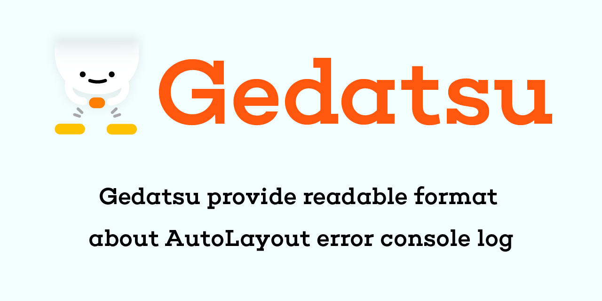

[](https://swift.org/download/) [](https://cocoapods.org/pods/Gedatsu) [](https://github.com/Carthage/Carthage) [](https://github.com/apple/swift-package-manager)

[](docs/logo.png)

# Gedatsu
Gedatsu provide readable format about AutoLayout error console log

## Abstract
In runtime Gedatsu hooking console log and format it to human readable about AutoLayout ambiguous constraints.

| Original |  Gedatsu  |
| ---- | ---- |
|    |    |

## Install
### Cocoapods
Add the line below to Podfile and to exec `$ pod install`.
```ruby
pod 'Gedatsu', configuration: %w(Debug)
```

### Carthage
Add the line below to Cartfile and to exec any `$ carthage checkout && carthage build` commands.  
e.g) `$ carthage bootstrap --platform iOS`.
```
github "bannzai/Gedatsu"
```

### Swift Package Manager
Gedatsu supported to install via Swift Package Manager.
You can add Gedatsu on Xcode GUI. See [document](https://developer.apple.com/documentation/xcode/adding_package_dependencies_to_your_app). 

## Usage
Gedatsu will start when after call `Gedatsu.open`.
As an good example for iOS project, call `Gedatsu.open` when `AppDelegate.application:didFinishLaunchingWithOptions:`.

```swift
#if DEBUG
import Gedatsu
#endif

func application(_ application: UIApplication, didFinishLaunchingWithOptions launchOptions: [UIApplication.LaunchOptionsKey: Any]?) -> Bool {
    #if DEBUG
    Gedatsu.open()
    #endif
    return true
}
```

## Support Versions
|  platform  |  version  |
| ---- | ---- |
|  iOS  |  >= 11.0  |  
|  macOS  |  >= 10.11  |  
|  Swift  |  >= 5.2  | 


## LICENSE
Gedatsu is released under the MIT license. See LICENSE for details.  
Header logo is released [CC BY-NC 4.0](https://creativecommons.org/licenses/by-nc/4.0/deed) license. Original design by [noainoue](https://github.com/noainoue).
